# 性能测试报告

## 测试结论

| Page | lighthouse |
| ---- | ---------- |
| https://ones-test.com/products/pipeline-integration.html | 通过 |

### 测试环境

|  -  |  -  |
| --- | --- |
| 测试时间 | 2023-07-14 06:38:42 |
| 测试工具 | lighthouse |
| 网络状态 | 上传速度：10 MB，下载速度：10 MB，延迟：0ms |
| 浏览器信息 | Mozilla/5.0 (Macintosh; Intel Mac OS X 10_15_7) AppleWebKit/537.36 (KHTML, like Gecko) Chrome/109.0.0.0 Safari/537.36 |
| 浏览器尺寸 | 1920x1080 |
| 测试次数 | 100 |

### 指标标准

|     | LCP | CLS |
| --- | --- | --- |
| 最优 | 1000 ms | 100 ms |
| 最差 | 1500 ms | 100 ms |

### 性能测试工具结果对比报告

| Page | Tool | LCP | CLS | FID | FCP | SI  | TTI | TBT |
| ---- | ---- | --- | --- | --- | --- | --- | --- | --- |
| https://ones-test.com/products/pipeline-integration.html | lighthouse | 
AVG: 0.770 s P75: 0.920 s P90: 1.427 s 
 | 
AVG: 0.025 s P75: 0.025 s P90: 0.025 s 
 | 
AVG: 2.686 s P75: 3.127 s P90: 3.681 s 
 | 
AVG: 0.094 s P75: 0.103 s P90: 0.116 s 
 | 
AVG: 0.783 s P75: 0.902 s P90: 1.016 s 
 | 
AVG: 2.686 s P75: 3.127 s P90: 3.681 s 
 | 
AVG: 0.099 s P75: 0.124 s P90: 0.154 s 
 |

### lighthouse 具体报告

| 测试页面 | 测试结果 |     |     |     |     |     |     |     |     |     |     |     |     |     |     |     |     |     |     |     |     |     |     |     |     |     |     |     |     |     |     |     |     |     |     |     |     |     |     |     |     |     |     |     |     |     |     |     |     |     |     |     |     |     |     |     |     |     |     |     |     |     |     |     |     |     |     |     |     |     |     |     |     |     |     |     |     |     |     |     |     |     |     |     |     |     |     |     |     |     |     |     |     |     |     |     |     |     |     |     |
| ---- | ---- | --- | --- | --- | --- | --- | --- | --- | --- | --- | --- | --- | --- | --- | --- | --- | --- | --- | --- | --- | --- | --- | --- | --- | --- | --- | --- | --- | --- | --- | --- | --- | --- | --- | --- | --- | --- | --- | --- | --- | --- | --- | --- | --- | --- | --- | --- | --- | --- | --- | --- | --- | --- | --- | --- | --- | --- | --- | --- | --- | --- | --- | --- | --- | --- | --- | --- | --- | --- | --- | --- | --- | --- | --- | --- | --- | --- | --- | --- | --- | --- | --- | --- | --- | --- | --- | --- | --- | --- | --- | --- | --- | --- | --- | --- | --- | --- | --- | --- | --- |
| https://ones-test.com/products/pipeline-integration.html | [run-1](lighthouse-result/ones-test_com__products_pipeline-integration_html/1.html) | [run-2](lighthouse-result/ones-test_com__products_pipeline-integration_html/10.html) | [run-3](lighthouse-result/ones-test_com__products_pipeline-integration_html/100.html) | [run-4](lighthouse-result/ones-test_com__products_pipeline-integration_html/11.html) | [run-5](lighthouse-result/ones-test_com__products_pipeline-integration_html/12.html) | [run-6](lighthouse-result/ones-test_com__products_pipeline-integration_html/13.html) | [run-7](lighthouse-result/ones-test_com__products_pipeline-integration_html/14.html) | [run-8](lighthouse-result/ones-test_com__products_pipeline-integration_html/15.html) | [run-9](lighthouse-result/ones-test_com__products_pipeline-integration_html/16.html) | [run-10](lighthouse-result/ones-test_com__products_pipeline-integration_html/17.html) | [run-11](lighthouse-result/ones-test_com__products_pipeline-integration_html/18.html) | [run-12](lighthouse-result/ones-test_com__products_pipeline-integration_html/19.html) | [run-13](lighthouse-result/ones-test_com__products_pipeline-integration_html/2.html) | [run-14](lighthouse-result/ones-test_com__products_pipeline-integration_html/20.html) | [run-15](lighthouse-result/ones-test_com__products_pipeline-integration_html/21.html) | [run-16](lighthouse-result/ones-test_com__products_pipeline-integration_html/22.html) | [run-17](lighthouse-result/ones-test_com__products_pipeline-integration_html/23.html) | [run-18](lighthouse-result/ones-test_com__products_pipeline-integration_html/24.html) | [run-19](lighthouse-result/ones-test_com__products_pipeline-integration_html/25.html) | [run-20](lighthouse-result/ones-test_com__products_pipeline-integration_html/26.html) | [run-21](lighthouse-result/ones-test_com__products_pipeline-integration_html/27.html) | [run-22](lighthouse-result/ones-test_com__products_pipeline-integration_html/28.html) | [run-23](lighthouse-result/ones-test_com__products_pipeline-integration_html/29.html) | [run-24](lighthouse-result/ones-test_com__products_pipeline-integration_html/3.html) | [run-25](lighthouse-result/ones-test_com__products_pipeline-integration_html/30.html) | [run-26](lighthouse-result/ones-test_com__products_pipeline-integration_html/31.html) | [run-27](lighthouse-result/ones-test_com__products_pipeline-integration_html/32.html) | [run-28](lighthouse-result/ones-test_com__products_pipeline-integration_html/33.html) | [run-29](lighthouse-result/ones-test_com__products_pipeline-integration_html/34.html) | [run-30](lighthouse-result/ones-test_com__products_pipeline-integration_html/35.html) | [run-31](lighthouse-result/ones-test_com__products_pipeline-integration_html/36.html) | [run-32](lighthouse-result/ones-test_com__products_pipeline-integration_html/37.html) | [run-33](lighthouse-result/ones-test_com__products_pipeline-integration_html/38.html) | [run-34](lighthouse-result/ones-test_com__products_pipeline-integration_html/39.html) | [run-35](lighthouse-result/ones-test_com__products_pipeline-integration_html/4.html) | [run-36](lighthouse-result/ones-test_com__products_pipeline-integration_html/40.html) | [run-37](lighthouse-result/ones-test_com__products_pipeline-integration_html/41.html) | [run-38](lighthouse-result/ones-test_com__products_pipeline-integration_html/42.html) | [run-39](lighthouse-result/ones-test_com__products_pipeline-integration_html/43.html) | [run-40](lighthouse-result/ones-test_com__products_pipeline-integration_html/44.html) | [run-41](lighthouse-result/ones-test_com__products_pipeline-integration_html/45.html) | [run-42](lighthouse-result/ones-test_com__products_pipeline-integration_html/46.html) | [run-43](lighthouse-result/ones-test_com__products_pipeline-integration_html/47.html) | [run-44](lighthouse-result/ones-test_com__products_pipeline-integration_html/48.html) | [run-45](lighthouse-result/ones-test_com__products_pipeline-integration_html/49.html) | [run-46](lighthouse-result/ones-test_com__products_pipeline-integration_html/5.html) | [run-47](lighthouse-result/ones-test_com__products_pipeline-integration_html/50.html) | [run-48](lighthouse-result/ones-test_com__products_pipeline-integration_html/51.html) | [run-49](lighthouse-result/ones-test_com__products_pipeline-integration_html/52.html) | [run-50](lighthouse-result/ones-test_com__products_pipeline-integration_html/53.html) | [run-51](lighthouse-result/ones-test_com__products_pipeline-integration_html/54.html) | [run-52](lighthouse-result/ones-test_com__products_pipeline-integration_html/55.html) | [run-53](lighthouse-result/ones-test_com__products_pipeline-integration_html/56.html) | [run-54](lighthouse-result/ones-test_com__products_pipeline-integration_html/57.html) | [run-55](lighthouse-result/ones-test_com__products_pipeline-integration_html/58.html) | [run-56](lighthouse-result/ones-test_com__products_pipeline-integration_html/59.html) | [run-57](lighthouse-result/ones-test_com__products_pipeline-integration_html/6.html) | [run-58](lighthouse-result/ones-test_com__products_pipeline-integration_html/60.html) | [run-59](lighthouse-result/ones-test_com__products_pipeline-integration_html/61.html) | [run-60](lighthouse-result/ones-test_com__products_pipeline-integration_html/62.html) | [run-61](lighthouse-result/ones-test_com__products_pipeline-integration_html/63.html) | [run-62](lighthouse-result/ones-test_com__products_pipeline-integration_html/64.html) | [run-63](lighthouse-result/ones-test_com__products_pipeline-integration_html/65.html) | [run-64](lighthouse-result/ones-test_com__products_pipeline-integration_html/66.html) | [run-65](lighthouse-result/ones-test_com__products_pipeline-integration_html/67.html) | [run-66](lighthouse-result/ones-test_com__products_pipeline-integration_html/68.html) | [run-67](lighthouse-result/ones-test_com__products_pipeline-integration_html/69.html) | [run-68](lighthouse-result/ones-test_com__products_pipeline-integration_html/7.html) | [run-69](lighthouse-result/ones-test_com__products_pipeline-integration_html/70.html) | [run-70](lighthouse-result/ones-test_com__products_pipeline-integration_html/71.html) | [run-71](lighthouse-result/ones-test_com__products_pipeline-integration_html/72.html) | [run-72](lighthouse-result/ones-test_com__products_pipeline-integration_html/73.html) | [run-73](lighthouse-result/ones-test_com__products_pipeline-integration_html/74.html) | [run-74](lighthouse-result/ones-test_com__products_pipeline-integration_html/75.html) | [run-75](lighthouse-result/ones-test_com__products_pipeline-integration_html/76.html) | [run-76](lighthouse-result/ones-test_com__products_pipeline-integration_html/77.html) | [run-77](lighthouse-result/ones-test_com__products_pipeline-integration_html/78.html) | [run-78](lighthouse-result/ones-test_com__products_pipeline-integration_html/79.html) | [run-79](lighthouse-result/ones-test_com__products_pipeline-integration_html/8.html) | [run-80](lighthouse-result/ones-test_com__products_pipeline-integration_html/80.html) | [run-81](lighthouse-result/ones-test_com__products_pipeline-integration_html/81.html) | [run-82](lighthouse-result/ones-test_com__products_pipeline-integration_html/82.html) | [run-83](lighthouse-result/ones-test_com__products_pipeline-integration_html/83.html) | [run-84](lighthouse-result/ones-test_com__products_pipeline-integration_html/84.html) | [run-85](lighthouse-result/ones-test_com__products_pipeline-integration_html/85.html) | [run-86](lighthouse-result/ones-test_com__products_pipeline-integration_html/86.html) | [run-87](lighthouse-result/ones-test_com__products_pipeline-integration_html/87.html) | [run-88](lighthouse-result/ones-test_com__products_pipeline-integration_html/88.html) | [run-89](lighthouse-result/ones-test_com__products_pipeline-integration_html/89.html) | [run-90](lighthouse-result/ones-test_com__products_pipeline-integration_html/9.html) | [run-91](lighthouse-result/ones-test_com__products_pipeline-integration_html/90.html) | [run-92](lighthouse-result/ones-test_com__products_pipeline-integration_html/91.html) | [run-93](lighthouse-result/ones-test_com__products_pipeline-integration_html/92.html) | [run-94](lighthouse-result/ones-test_com__products_pipeline-integration_html/93.html) | [run-95](lighthouse-result/ones-test_com__products_pipeline-integration_html/94.html) | [run-96](lighthouse-result/ones-test_com__products_pipeline-integration_html/95.html) | [run-97](lighthouse-result/ones-test_com__products_pipeline-integration_html/96.html) | [run-98](lighthouse-result/ones-test_com__products_pipeline-integration_html/97.html) | [run-99](lighthouse-result/ones-test_com__products_pipeline-integration_html/98.html) | [run-100](lighthouse-result/ones-test_com__products_pipeline-integration_html/99.html) |

#### lighthouse 折线图

